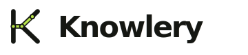

<div align="center">

<picture>
  <source media="(prefers-color-scheme: dark)" srcset="design/brand/assets/knowlery-lockup-dark.svg">
  
</picture>

**The knowledge base your agents can live in.**

A local-first knowledge system for people and agents.<br>
Plain Markdown in. Traceable knowledge out.

[](https://github.com/JayJiangCT/knowlery/releases)
[](https://www.npmjs.com/package/knowlery)
[](https://jayjiangct.github.io/knowlery/)
[](LICENSE)

</div>

One plain-markdown workspace,
served by three shells: an **MCP server** and **CLI** for Codex, Claude,
Cursor, and Antigravity — and an **Obsidian plugin** as its richest human
interface. Obsidian maximizes Knowlery; nothing about it requires Obsidian.

Your free-form notes stay yours. Agents get a structured, retrievable layer —
`entities/`, `concepts/`, `comparisons/`, `queries/` — compiled from your
material through a reviewed pipeline, plus the skills and conduct that make
them good collaborators. Retrieval is deterministic and measured, answers
carry citations, and "no confident match" is an honest verdict instead of
noise. The workspace format, CLI surface, and MCP contracts are frozen under
semver and pinned by contract tests.

Read the official documentation: <https://jayjiangct.github.io/knowlery/>.

## Two ways to start

### With your agent (no Obsidian required)

Install the **agent plugin** — MCP server plus all fifteen skills — with a
two-command marketplace flow:

```text
Claude Code:  /plugin marketplace add JayJiangCT/knowlery
              /plugin install knowlery

Codex:        codex plugin marketplace add JayJiangCT/knowlery
              codex plugin add knowlery@knowlery
```

Start a new agent session after installation so the bundled skills and MCP
tools are loaded. In Codex Desktop, open **Plugins → Installed** to confirm
that Knowlery is enabled.

Or add one MCP config block to any client (Cursor, Claude Desktop,
Antigravity, …):

```json
{ "command": "npx", "args": ["-y", "knowlery@^1", "mcp"] }
```

Then everything is conversation: *"set up a knowledge base called main"*,
*"remember this"*, *"what do I know about X?"*, *"give my KB a checkup"*.
Per-client setup: [Connect Your Agent](https://jayjiangct.github.io/knowlery/guides/connect-your-agent) ·
usage by conversation: [Talk to Your Knowledge Base](https://jayjiangct.github.io/knowlery/guides/talk-to-your-kb).

### In Obsidian

Install **Knowlery** from Obsidian's community plugin directory
(Settings → Community plugins → Browse) and run the setup wizard. You get the
action-first dashboard, Knowledge health, and the bundle sharing UI — and the
vault registers itself so every agent can address it by name. Full walkthrough: [Start in Obsidian](https://jayjiangct.github.io/knowlery/getting-started/obsidian).

Either way it's the same plain folder: a KB born in a conversation opens in
Obsidian with zero migration, and an Obsidian vault is automatically
available to your agents.

## Brand

Knowlery's identity is the **Atlas Fold** system — a K-shaped route connecting
source, structure, and retrieval, drawn in graphite and paper with a single
**Knowledge Lime** signal. The metaphor is deliberate: **a map you can trust,
not a mind you have to believe.**

| | |
|---|---|
| **Position** | Local-first knowledge infrastructure — your notes remain plain Markdown; Knowlery adds structure, retrieval, and agent access without taking ownership of the source. |
| **Character** | Exact, calm, and quietly alive — technical enough to earn developer trust, warm enough to feel like a place where knowledge accumulates. |
| **Difference** | Structure over spectacle — no chatbot face, neural cloud, or AI glow. The visual language is navigation through a maintained body of knowledge. |

The full brand system — logo construction, palette, typography, voice, and
usage rules — lives in [`design/brand/`](design/brand/) (open
[`brand-guide.html`](design/brand/brand-guide.html) in a browser). Marks,
lockups, and the app icon are under
[`design/brand/assets/`](design/brand/assets/).

## Inspiration: LLM Wiki & BYOAO

### Andrej Karpathy's "LLM Wiki"

In [LLM Wiki](https://gist.github.com/karpathy/442a6bf555914893e9891c11519de94f), Andrej Karpathy describes a pattern different from one-off RAG: instead of re-deriving answers from raw notes on every question, an agent **incrementally builds and maintains a persistent wiki**—structured, interlinked markdown that sits between you and your sources. New material is read, distilled, and **folded into** entity pages, topic summaries, and cross-links; the base is **kept current** rather than re-scanned from scratch each time.

Knowlery operationalizes that maintenance story: the layout (`KNOWLEDGE.md`, `SCHEMA.md`, the four compiled directories), the skills (`/cook`, `/ask`, and friends), the staleness report that tells the agent exactly what to fold in next, and the health checks that keep the machinery honest — with a clear boundary (your free-form notes stay yours; the agent works the shared map).

### BYOAO

[BYOAO](https://github.com/JayJiangCT/BYOAO) (*Build Your Own AI OS*) was Knowlery's predecessor: an OpenCode-oriented flow that turned Obsidian into an AI-powered "LLM Wiki" style knowledge base with global CLI install. Working on BYOAO is what made it natural to ask: **what if the same ideas lived as a first-class Obsidian plugin** — and, later, as a proper CLI, an MCP server, and an agent plugin too. **BYOAO is archived** — its role is fully superseded.

## Getting started (video)


**[▶ Full walkthrough](https://github.com/JayJiangCT/knowlery/blob/main/media/knowlery-walkthrough.mp4)** (~3 min, with audio) · same file: [Releases](https://github.com/JayJiangCT/knowlery/releases)

## The CLI and MCP server

One-line install (isolated prefix, PATH handled with consent — never silently):

```bash
curl -fsSL https://jayjiangct.github.io/knowlery/install.sh | sh
```

(Or `npm i -g knowlery`, or zero-install via `npx -y knowlery@^1 <command>`.)

```bash
knowlery init     # scaffold a workspace (works brownfield — never touches your notes)
knowlery kb add work ~/vaults/work-kb    # name it; every command and agent can address it
knowlery sync     # bring skills, rules, and the retrieval script up to date
knowlery health   # config integrity + knowledge-page counts; exit code for CI
knowlery query --kb work "<question>"    # deterministic retrieval, from any directory
knowlery query --kb '*' "<question>"     # federated search across every registered KB
knowlery stale    # compiled pages whose sources changed; notes never compiled
knowlery bundle install <zip-folder-or-url>  # install a shared knowledge bundle
knowlery bundle publish <seed>               # review-gated publish to a GitHub Release
knowlery mcp      # MCP server over stdio: 9 tools, 10 skill prompts, page resources
knowlery mcp serve --port <n> --token-file <path>   # self-hosted remote mode
```

Retrieval works headlessly too: `node .knowlery/bin/query.mjs "<question>"` (written by
`init`/`sync`) searches the workspace with Obsidian closed.

## The Obsidian plugin

Requirements: Obsidian desktop 1.12.2+, community plugins enabled. Claude Code or OpenCode if you want to run installed skills from the dashboard; Node.js/npm for the optional external skills registry. Knowlery is desktop-only because it uses local command-line tools and Electron desktop APIs.

During the setup wizard, Knowlery can detect whether Claude Code, OpenCode, Node.js, and the external `skills` CLI are available, and can optionally help install or prepare missing agent tools. These steps are opt-in; if a tool is already installed, Knowlery skips it.

### Install beta builds with BRAT

BRAT is the **Beta Reviewers Auto-update Tool** for Obsidian. Upstream project: [`TfTHacker/obsidian42-brat`](https://github.com/TfTHacker/obsidian42-brat) (documentation: [tfthacker.com/BRAT](https://tfthacker.com/BRAT)).

1. Install the **BRAT** plugin in Obsidian.
2. Open **BRAT** settings, **Add Beta plugin**, and use `https://github.com/JayJiangCT/knowlery`.
3. Enable **Knowlery** under Settings → Community plugins.

### Manual install

1. Download `main.js`, `manifest.json`, and `styles.css` from the [latest release](https://github.com/JayJiangCT/knowlery/releases).
2. Put those files in `.obsidian/plugins/knowlery/` inside your vault.
3. Reload Obsidian and enable Knowlery from Settings → Community plugins.

### Agent chat in Obsidian (optional companions)

If you also want a **full agent chat** inside Obsidian (sidebar, inline edit, multi-provider), consider installing one of these **in addition to** Knowlery:

- **[Claudian](https://github.com/YishenTu/claudian)** — embeds Claude Code, Codex, and related flows in the vault; file read/write and bash from a chat UI.
- **[obsidian-agent-client](https://github.com/RAIT-09/obsidian-agent-client)** — brings agents in via Agent Client Protocol (ACP) with multi-session and MCP support.

## What Knowlery Creates

During setup and normal use, Knowlery can create or update these files and folders inside your workspace:

- `KNOWLEDGE.md`
- `SCHEMA.md` (knowledge taxonomy and page conventions)
- `INDEX.base`
- `entities/`, `concepts/`, `comparisons/`, and `queries/`
- `inbox/`, when the MCP `capture` tool saves conversation notes
- `.knowlery/manifest.json`
- `.agents/skills/` and `.agents/rules/`
- `.claude/skills/`, `.claude/rules/`, and `.claude/CLAUDE.md`
- `opencode.json`, when OpenCode is selected
- `skills-lock.json`
- `.knowlery/activity/`, when activity logging is enabled
- `.knowlery/reports/`, when Weekly summary generates an HTML report
- `.knowlery/requests/` and `.knowlery/reviews/`, when daily review polish is used
- `.knowlery/exports/`, when Share knowledge bundle compiles a bundle (plus an optional `.zip` next to it)
- `Library/<bundle-id>/` and `.knowlery/bundles.json`, when Install knowledge bundle installs a shared bundle
- `.knowlery/bin/query.mjs`, the local retrieval script (written on setup and refreshed on upgrades)
- `~/.config/knowlery/registry.json`, the global registry of named knowledge bases (outside the vault)

Knowlery may delete skill or rule files only when you use the corresponding delete or disable actions in the UI, and may delete an installed bundle's `Library/<bundle-id>/` folder when you uninstall that bundle.

## Permissions and Disclosures

Knowlery does not collect telemetry.

Knowlery reads and writes files inside your workspace to create and maintain the knowledge base layout, bundled skills, rules, activity summaries, review requests, and generated reports listed above. It also reads Obsidian's configured plugin directory when detecting or installing optional companion plugins.

Network access is opt-in and feature-specific. The skill browser can call the external `skills` registry through `npx skills ...` when you search for or install registry skills. Bundle install/publish/update can contact the URLs and GitHub repositories you point them at (private access delegates to your own `gh` login; Knowlery never asks for or stores tokens). The setup wizard can download the latest Claudian release from GitHub when you choose to install that optional companion plugin.

Knowlery can run local CLI commands such as `claude`, `opencode`, `node`, `npx`, `gh`, and `skills` when you explicitly use CLI-related features. These commands run on your computer with your user permissions. Knowlery does not send vault contents to those tools by itself; agent requests are created only from the actions you trigger.

The MCP server (`knowlery mcp`) runs locally over stdio and serves only the knowledge bases you registered; resource reads are allowlisted to the curated knowledge surface — free-form notes are not readable over MCP. Remote mode (`knowlery mcp serve`) requires an explicit port and a bearer token you generate, is read-only unless each write is individually enabled by flag, and never logs or stores the token. The agent plugin performs no install scripts: MCP provisioning is configuration plus npx.

On Obsidian 1.12.2+ with the command line interface enabled, Knowlery registers two read-only CLI commands, `knowlery:query` and `knowlery:stale`, which search and inspect vault content locally when you (or an agent you run) invoke them. The bundled `.knowlery/bin/query.mjs` script does the same offline with plain Node; neither makes network requests.

Some companion tools or services used with Knowlery, including Claude Code, OpenCode, registry skills, or model providers configured outside Knowlery, may require separate accounts or paid usage. Knowlery itself is free and does not process payments.

## Development

```bash
npm install
npm run build          # plugin (main.js) + CLI (knowlery-cli.mjs)
npm test               # behavior + contract suites
npm run build:plugin   # regenerate the agent plugin tree (drift-guarded in CI)
```

Release assets include `main.js`, `manifest.json`, `styles.css`, and
`knowlery-plugin-<version>.zip`. Architecture and design docs:
[Architecture](https://jayjiangct.github.io/knowlery/developer/architecture) ·
[Design Decisions](https://jayjiangct.github.io/knowlery/developer/design) ·
[Stability Contract](https://jayjiangct.github.io/knowlery/reference/stability).

## License

MIT (see [LICENSE](LICENSE)).
