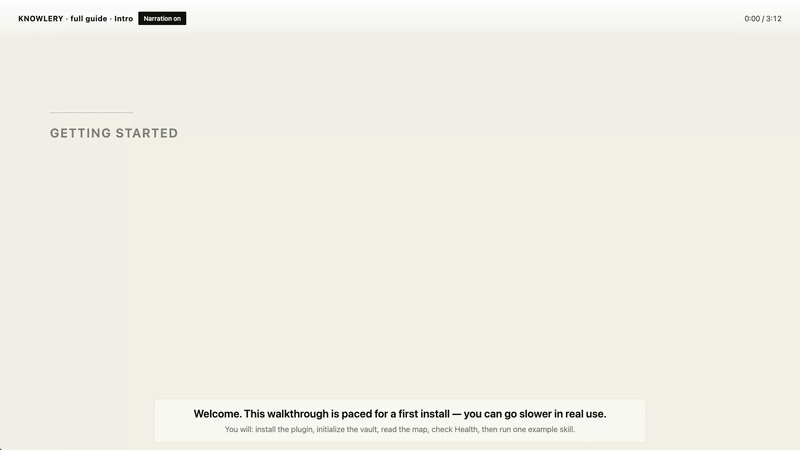

# Knowlery

[](https://github.com/JayJiangCT/knowlery/releases)
[](LICENSE)

Knowlery turns an Obsidian vault into an AI-powered knowledge base control panel. It helps initialize a vault structure, install and manage agent skills, configure agent rules, and run vault health diagnostics for Claude Code and OpenCode workflows.

## Inspiration: LLM Wiki & BYOAO

### Andrej Karpathy’s “LLM Wiki”

In [LLM Wiki](https://gist.github.com/karpathy/442a6bf555914893e9891c11519de94f), Andrej Karpathy describes a pattern different from one-off RAG: instead of re-deriving answers from raw notes on every question, an agent **incrementally builds and maintains a persistent wiki**—structured, interlinked markdown that sits between you and your sources. New material is read, distilled, and **folded into** entity pages, topic summaries, and cross-links; the base is **kept current** rather than re-scanned from scratch each time.

Knowlery’s take is **aligned with that maintenance story** for your vault: it gives you the layout (`KNOWLEDGE.md`, `SCHEMA.md`, `entities/`, `concepts/`, `comparisons/`, `queries/`), agent skills, and health checks so a coding agent can **compile and maintain** structured knowledge pages from your notes—while keeping a clear boundary (your free-form notes stay yours; the agent works the shared map). It is an opinionated, Obsidian-native way to operationalize the “LLM wiki” idea on the desktop.

### BYOAO

[BYOAO](https://github.com/JayJiangCT/BYOAO) (*Build Your Own AI OS*) is a separate project: an OpenCode-oriented flow that turns Obsidian into an AI-powered “LLM Wiki” style knowledge base with global CLI install. Working on BYOAO is what made it natural to ask: **what if the same ideas lived as a first-class Obsidian plugin**—settings, setup wizard, skills, and health—without leaving the app? Knowlery is that plugin-shaped experiment: same family of ideas, different packaging (plugin UI + vault-side wiring for Claude Code / OpenCode).

## Getting started (video)

GitHub **does not render** a custom HTML5 `<video>` block inside the README (the HTML is **sanitized**), so you will not get a YouTube-style player **embedded in this README file**. What works is:

- **A preview in the README** (below): a **silent animated GIF** (~12s from the start) so you see motion immediately in this page.
- **Full video with audio (recommended):** open the MP4 in GitHub’s own **file viewer** — it has a real **play/pause bar and audio**. This streams in the browser; it is not a “force download” flow in normal browsers.

### Preview (first ~12s, no audio)



### Full walkthrough (~3:12, with U.S. English TTS in the source recording)

**[▶ Play the full video on GitHub (built-in player)](https://github.com/JayJiangCT/knowlery/blob/main/media/knowlery-walkthrough.mp4)**

*The same file is mirrored on [Releases](https://github.com/JayJiangCT/knowlery/releases) for tooling that expects release assets.*

**Maintainers:** update [`media/knowlery-walkthrough.mp4`](media/knowlery-walkthrough.mp4), then regenerate [`media/knowlery-walkthrough-preview.gif`](media/knowlery-walkthrough-preview.gif) from the first ~12s (palette GIF, ~800px wide) so the README preview stays current.

## Requirements

- Obsidian desktop.
- Community plugins enabled.
- Claude Code or OpenCode, if you want to run installed skills from the dashboard.
- Node.js and npm, if you want to browse or install skills from the external skills registry.

Knowlery is desktop-only because it uses local command-line tools and Electron desktop APIs.

### Agent chat in Obsidian (optional companions)

Knowlery focuses on **vault layout, skills, rules, and health** for agent workflows. If you also want a **full agent chat** inside Obsidian (sidebar, inline edit, multi-provider), consider installing one of these **in addition to** Knowlery:

- **[Claudian](https://github.com/YishenTu/claudian)** — embeds Claude Code, Codex, and related flows in the vault; file read/write and bash from a chat UI.
- **[obsidian-agent-client](https://github.com/RAIT-09/obsidian-agent-client)** — brings agents in via Agent Client Protocol (ACP) (e.g. Claude Code, Codex, Gemini CLI) with multi-session and MCP support.

## Install with BRAT

BRAT is the **Beta Reviewers Auto-update Tool** for Obsidian. Upstream project: [`TfTHacker/obsidian42-brat`](https://github.com/TfTHacker/obsidian42-brat) (documentation: [tfthacker.com/BRAT](https://tfthacker.com/BRAT)).

Knowlery can be installed as a beta plugin through BRAT before it is listed in the community plugin directory.

1. Install the **BRAT** plugin in Obsidian (from Community plugins, or build from the [BRAT repository](https://github.com/TfTHacker/obsidian42-brat) above).
2. Open **BRAT** settings.
3. **Add Beta plugin** and use this repository URL: `https://github.com/JayJiangCT/knowlery` (or the short form `JayJiangCT/knowlery` if BRAT accepts it).
4. Enable **Knowlery** under Settings → Community plugins.

## Manual install

1. Download `main.js`, `manifest.json`, and `styles.css` from the [latest release](https://github.com/JayJiangCT/knowlery/releases).
2. Put those files in `.obsidian/plugins/knowlery/` inside your vault.
3. Reload Obsidian and enable Knowlery from Settings -> Community plugins.

## What Knowlery Creates

During setup, Knowlery can create or update these files and folders inside your vault:

- `KNOWLEDGE.md`
- `SCHEMA.md`
- `entities/`, `concepts/`, `comparisons/`, and `queries/`
- `.knowlery/manifest.json`
- `.agents/skills/` and `.agents/rules/`
- `.claude/skills/`, `.claude/rules/`, and `.claude/CLAUDE.md`
- `opencode.json`, when OpenCode is selected
- `skills-lock.json`

Knowlery may delete skill or rule files only when you use the corresponding delete or disable actions in the UI.

## Network and Command Use

Knowlery does not collect telemetry.

The skill browser can call the external `skills` registry through `npx skills ...` when you search for or install registry skills. This may connect to external services used by the skills CLI. Registry skill installation writes copied skill files into your vault.

Knowlery can run local CLI commands such as `claude`, `opencode`, `node`, `npx`, and `skills` when you explicitly use CLI-related features. These commands run on your computer with your user permissions.

## Development

```bash
npm install
npm run build
```

The production build writes `main.js`. Release assets should include:

- `main.js`
- `manifest.json`
- `styles.css`

## License

MIT (see [LICENSE](LICENSE)).
